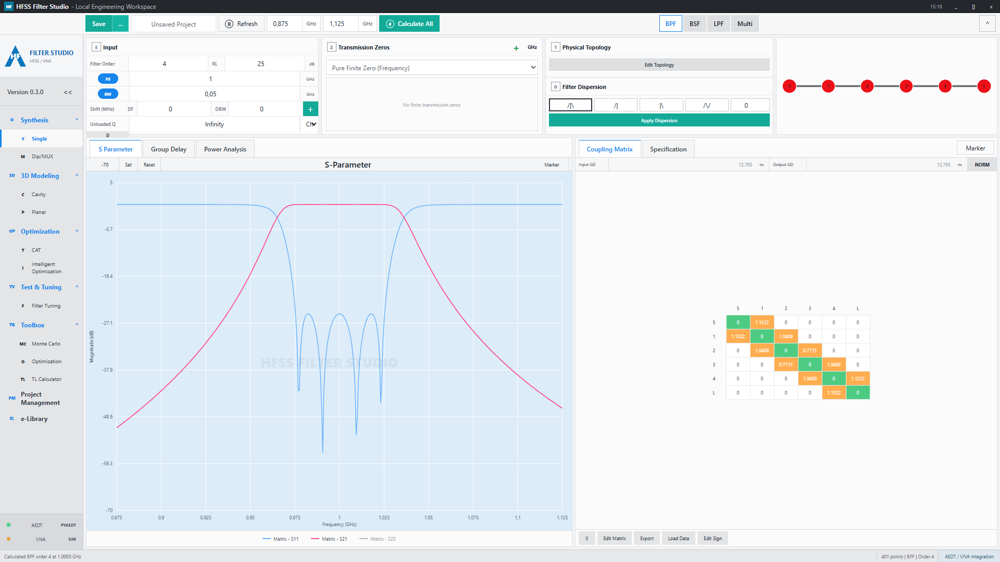

# HFSS VNA Bridge

Aplicacao Python 3.14 original para automatizar AEDT/HFSS e aquisicao de VNA
por uma API HTTP local.

O objetivo do projeto e fornecer uma base propria, documentada e testavel para:

- abrir ou reutilizar projetos AEDT/HFSS;
- listar e alterar variaveis de projeto/design;
- executar analises HFSS e exportar dados Touchstone;
- controlar um VNA por SCPI via PyVISA;
- operar em modo simulado quando AEDT ou hardware nao estiverem disponiveis;
- integrar scripts, GUIs ou otimizadores sem acoplar a regra de negocio ao AEDT.
- sintetizar respostas BPF, BSF, LPF e multi-banda com NumPy/SciPy;
- visualizar parametros S, atraso de grupo, potencia, matriz e topologia;
- editar/exportar matriz e salvar/carregar projetos JSON.

Este repositorio nao contem codigo fonte recuperado, nomes internos proprietarios,
patches, binarios, licencas, credenciais ou assets de terceiros. A implementacao foi
escrita do zero usando apenas requisitos tecnicos de interoperabilidade.



## Status

- Versao da aplicacao: `0.3.0`
- Python: `>=3.14`
- Servidor padrao: Flask + JavaScript local
- API tecnica opcional: FastAPI
- AEDT/HFSS: backend `pyaedt`, validado com AEDT 2026.1
- Sintese: prototipos Chebyshev, Butterworth, Bessel e Elliptic
- VNA: backend `pyvisa`
- Superficie SymMatrix MVP: `/aedt/<method>`, `/hfss/<method>` e `POST /<method>`
- Testes offline: backends `simulated`
- Saida de rede: Touchstone `.s2p`
- UI: workstation desktop responsiva, sem dependencias frontend externas

Validado localmente com:

```powershell
.\.venv\Scripts\python --version
.\.venv\Scripts\python -m pytest
.\.venv\Scripts\python -m ruff check .
```

## Requisitos

Obrigatorios para desenvolvimento:

- Windows
- `uv`
- Git
- Python 3.14 gerenciado pelo `uv`

Obrigatorios para uso com AEDT/HFSS real:

- Ansys Electronics Desktop instalado
- Licenca AEDT/HFSS valida
- Pacote `pyaedt`

Obrigatorios para uso com VNA real:

- VNA acessivel por LAN/USB/GPIB
- VISA runtime compatavel, como NI-VISA ou Keysight IO Libraries
- Pacote `pyvisa`

## Instalacao Rapida

Na pasta do projeto:

```powershell
uv python install 3.14
uv venv --python 3.14
.\.venv\Scripts\python -m pip install -e ".[dev,aedt,vna]"
```

Para instalar somente o modo simulado:

```powershell
uv python install 3.14
uv venv --python 3.14
.\.venv\Scripts\python -m pip install -e ".[dev]"
```

Tambem ha um script equivalente:

```powershell
.\scripts\setup.ps1 -WithHardware
```

## Executar

```powershell
.\.venv\Scripts\python -m hfss_vna_bridge --host 127.0.0.1 --port 8765
```

O servidor padrao e Flask. A interface local fica em:

```text
http://127.0.0.1:8765/
```

Ou:

```powershell
.\scripts\run.ps1 -HostName 127.0.0.1 -Port 8765
```

Health check:

```powershell
Invoke-RestMethod http://127.0.0.1:8765/health
```

Para executar a API FastAPI anterior:

```powershell
.\.venv\Scripts\python -m hfss_vna_bridge --server fastapi --host 127.0.0.1 --port 8765
```

Documentacao interativa da API FastAPI:

- Swagger UI: `http://127.0.0.1:8765/docs`
- OpenAPI JSON: `http://127.0.0.1:8765/openapi.json`

## Estrutura

```text
hfss_vna_bridge/
  docs/
    aedt_contract.md
    api_reference.md
    architecture.md
    originalidade.md
    setup.md
    troubleshooting.md
    vna_contract.md
    workflows.md
  scripts/
    run.ps1
    setup.ps1
  src/hfss_vna_bridge/
    adapters/
      aedt/
      vna/
    api/
    core/
    services/
    web/
    cli.py
    settings.py
  tests/
  pyproject.toml
  uv.lock
```

## Endpoints Principais Flask/SymMatrix

Sintese:

- `POST /api/synthesis/calculate`

VNA local:

- `POST /status`
- `POST /connect`
- `POST /reset`
- `POST /setfrequency`
- `POST /setifbw`
- `POST /setpower`
- `POST /setsweeppoints`
- `POST /singlesweep`
- `POST /savetracedata`
- `POST /exports2p`

AEDT/HFSS local:

- `POST /aedt/openproject`
- `POST /aedt/getdesigns`
- `POST /aedt/getvariables`
- `POST /aedt/getvariablesvalue`
- `POST /aedt/setvariablesvalue`
- `POST /aedt/evaluatedimension`
- `POST /aedt/evaluatedimensionnos2p`
- `POST /hfss/ping`
- `POST /hfss/openproject`
- `POST /hfss/updatevalues`
- `POST /hfss/analyzeall`

Endpoints reservados para o roadmap retornam `status=-501` com `implemented=false`.

## Endpoints REST Tambem Suportados

AEDT/HFSS:

- `POST /aedt/session`
- `GET /aedt/designs`
- `GET /aedt/variables`
- `POST /aedt/variables`
- `POST /aedt/analyze`

VNA:

- `POST /vna/connect`
- `GET /vna/status`
- `POST /vna/reset`
- `POST /vna/configure-sweep`
- `POST /vna/single-sweep`
- `POST /vna/save-touchstone`

Aliases de compatibilidade:

- `POST /connect`
- `GET /status`
- `POST /reset`
- `POST /setfrequency`
- `POST /setifbw`
- `POST /setpower`
- `POST /singlesweep`
- `POST /savetracedata`

Veja [docs/api_reference.md](docs/api_reference.md) para payloads completos.

## Uso em Modo Simulado

Conectar VNA simulado:

```powershell
Invoke-RestMethod http://127.0.0.1:8765/vna/connect `
  -Method Post -ContentType "application/json" `
  -Body '{"backend":"simulated","resource":"SIM::VNA"}'
```

Configurar sweep:

```powershell
Invoke-RestMethod http://127.0.0.1:8765/vna/configure-sweep `
  -Method Post -ContentType "application/json" `
  -Body '{"start_hz":600000000,"stop_hz":1100000000,"points":101,"ifbw_hz":1000,"power_dbm":-10}'
```

Executar sweep unico:

```powershell
Invoke-RestMethod http://127.0.0.1:8765/vna/single-sweep -Method Post
```

Conectar AEDT simulado:

```powershell
Invoke-RestMethod http://127.0.0.1:8765/aedt/session `
  -Method Post -ContentType "application/json" `
  -Body '{"backend":"simulated","design_name":"OfflineDesign"}'
```

## Uso com AEDT/HFSS Real

Exemplo para abrir o arquivo do painel triband:

```powershell
Invoke-RestMethod http://127.0.0.1:8765/aedt/session `
  -Method Post -ContentType "application/json" `
  -Body '{"backend":"pyaedt","project_path":"D:\\dev\\HFSS_AUTO\\painel triBand.aedt","version":"2026.1","new_desktop":false,"machine":"localhost","port":49152}'
```

Detectar instalacoes e sessoes gRPC:

```powershell
Invoke-RestMethod http://127.0.0.1:8765/api/aedt/installations
```

Listar variaveis:

```powershell
Invoke-RestMethod http://127.0.0.1:8765/aedt/variables
```

Alterar variaveis:

```powershell
Invoke-RestMethod http://127.0.0.1:8765/aedt/variables `
  -Method Post -ContentType "application/json" `
  -Body '{"variables":{"arm_scale_a":1.02,"dist_refletor":"21mm"}}'
```

Rodar analise e exportar Touchstone:

```powershell
Invoke-RestMethod http://127.0.0.1:8765/aedt/analyze `
  -Method Post -ContentType "application/json" `
  -Body '{"setup_name":"Setup1","sweep_name":"Sweep1","output_touchstone":"D:\\simulation\\hfss_export.s2p"}'
```

## Uso com VNA Real

Exemplo LAN/VISA:

```powershell
Invoke-RestMethod http://127.0.0.1:8765/vna/connect `
  -Method Post -ContentType "application/json" `
  -Body '{"backend":"pyvisa","resource":"TCPIP0::192.168.0.50::inst0::INSTR","timeout_ms":30000}'
```

Configurar e medir:

```powershell
Invoke-RestMethod http://127.0.0.1:8765/vna/configure-sweep `
  -Method Post -ContentType "application/json" `
  -Body '{"start_hz":600000000,"stop_hz":1100000000,"points":201,"ifbw_hz":1000,"power_dbm":-10}'

Invoke-RestMethod http://127.0.0.1:8765/vna/single-sweep -Method Post
```

Salvar Touchstone:

```powershell
Invoke-RestMethod http://127.0.0.1:8765/vna/save-touchstone `
  -Method Post -ContentType "application/json" `
  -Body '{"path":"D:\\simulation\\vna_measurement.s2p"}'
```

## Variaveis de Ambiente

```powershell
$env:HFSS_BRIDGE_HOST = "127.0.0.1"
$env:HFSS_BRIDGE_PORT = "8765"
$env:HFSS_BRIDGE_AEDT_PROJECT = "D:\simulation\painel triband.aedt"
$env:HFSS_BRIDGE_AEDT_DESIGN = "HFSSDesign1"
$env:HFSS_BRIDGE_AEDT_VERSION = "2026.1"
$env:HFSS_BRIDGE_VNA_BACKEND = "simulated"
$env:HFSS_BRIDGE_VNA_RESOURCE = "SIM::VNA"
```

## Testes e Qualidade

```powershell
.\.venv\Scripts\python -m pytest
.\.venv\Scripts\python -m ruff check .
```

Os testes automatizados usam adaptadores simulados e mocks de contrato. A
validacao real do AEDT pode ser executada separadamente:

```powershell
.\.venv\Scripts\python scripts\validate_aedt_2026.py `
  --project "D:\dev\HFSS_AUTO\painel triBand.aedt" `
  --attach --machine localhost --port 49152
```

## Documentacao

- [docs/setup.md](docs/setup.md): instalacao e ambiente.
- [docs/api_reference.md](docs/api_reference.md): referencia HTTP.
- [docs/symmatrix_mvp.md](docs/symmatrix_mvp.md): matriz MVP SymMatrix.
- [docs/professional_ui.md](docs/professional_ui.md): contrato detalhado da interface.
- [docs/architecture.md](docs/architecture.md): desenho da aplicacao.
- [docs/aedt_contract.md](docs/aedt_contract.md): contrato AEDT/HFSS.
- [docs/aedt_2026_integration.md](docs/aedt_2026_integration.md): conexao AEDT 2026 validada.
- [docs/filter_engine.md](docs/filter_engine.md): equacoes e validacao do motor real.
- [docs/vna_contract.md](docs/vna_contract.md): contrato VNA/SCPI.
- [docs/workflows.md](docs/workflows.md): fluxos operacionais.
- [docs/troubleshooting.md](docs/troubleshooting.md): diagnostico de falhas comuns.
- [docs/originalidade.md](docs/originalidade.md): politica de originalidade.

## Publicacao no GitHub

Repositorio remoto:

```text
https://github.com/Gecesars/hfss_filter_sym.git
```

Configurar e enviar:

```powershell
git remote add origin https://github.com/Gecesars/hfss_filter_sym.git
git push -u origin main
```
